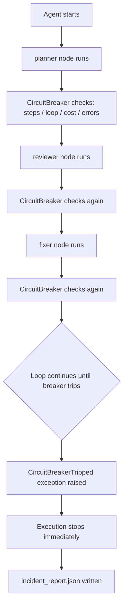

# AgentOps Circuit Breaker

Stops infinite LLM agent loops before they drain your budget.

## The problem

In production, LLM agents can get stuck in loops. They may call tools repeatedly, re-plan endlessly, or bounce between nodes indefinitely. Existing observability tools such as LangSmith and Helicone record what happened after the fact, but they do not stop the loop while it is happening. This project is the enforcement layer that is missing.

A production agent loop ran for days undetected because every individual API call returned 200 OK. The system looked healthy. The loop was invisible to standard monitoring.

## Architecture



## Enforcement conditions

The breaker enforces four hard limits on every transition:

- MAX_STEPS = 10: kills the run if total steps exceed this limit.
- LOOP_DETECTION = 3: kills the run if the same node is visited three times consecutively.
- MAX_COST_USD = 0.05: kills the run if the estimated cumulative cost exceeds this limit.
- MAX_ERRORS = 3: kills the run if consecutive errors exceed this limit.

## Real test output

```text
Starting agent run...
Prompt: Review this Python function for bugs
[breaker] step=1  node=planner  repeat_count=0  cost=$0.000000
[breaker] step=2  node=reviewer repeat_count=1  cost=$0.000070
[breaker] step=3  node=fixer    repeat_count=1  cost=$0.000320
[breaker] step=4  node=reviewer repeat_count=1  cost=$0.000741
[breaker] step=5  node=fixer    repeat_count=1  cost=$0.001355
[breaker] step=6  node=reviewer repeat_count=1  cost=$0.002404
[breaker] step=7  node=fixer    repeat_count=1  cost=$0.003287
[breaker] step=8  node=reviewer repeat_count=1  cost=$0.004101
[breaker] step=9  node=fixer    repeat_count=1  cost=$0.004487
[breaker] step=10 node=reviewer repeat_count=1  cost=$0.005091
[breaker] step=11 node=fixer    repeat_count=1  cost=$0.005696
CIRCUIT BREAKER TRIPPED: max steps exceeded: 11 > 10
```

## Real incident report

```json
{
  "timestamp": "2026-07-12T12:58:44.872778+00:00",
  "trigger_reason": "max steps exceeded: 11 > 10",
  "steps_taken": 11,
  "nodes_visited": [
    "planner", "reviewer", "fixer", "reviewer", "fixer",
    "reviewer", "fixer", "reviewer", "fixer", "reviewer", "fixer"
  ],
  "estimated_cost_usd": 0.005696,
  "token_usage": {
    "input_tokens": 5610,
    "output_tokens": 3020,
    "total_tokens": 8630
  }
}
```

## Why this matters

At $0.005696 per 11 steps, an unguarded loop running for hours would cost hundreds of dollars. The circuit breaker stopped it at step 11. The incident report gives you the full picture: when it happened, why it tripped, every node visited, and the exact cost.

## Quick start

### Prerequisites

- Python 3.10+
- A free Groq API key from console.groq.com (no credit card required)

### Setup

```bash
git clone https://github.com/muhammadnsererko/agentops-circuit-breaker.git
cd agentops-circuit-breaker
pip install -r requirements.txt
```

Add your Groq API key to .env:

```bash
GROQ_API_KEY=your_key_here
```

Run the demo:

```bash
python test_run.py
```

## Who this is for

### Real-world scenarios

**Software companies — AI coding assistants**
A development team deploys a LangGraph agent to automatically 
review pull requests, suggest fixes, and re-review after changes. 
The agent enters a loop: reviewer finds issues, fixer applies 
changes, reviewer finds new issues, fixer applies more changes — 
indefinitely. Without a circuit breaker, this runs for hours. 
With it, the breaker trips at step 10, writes an incident report, 
and the on-call engineer is notified immediately.

**Consulting firms — AI research agents**
A consulting firm deploys an agent to gather market research 
autonomously. The agent gets stuck repeatedly searching for the 
same information with slightly different queries, never deciding 
it has enough data to proceed. The cost ceiling trips the breaker 
before the bill reaches hundreds of dollars.

**Customer service teams — AI escalation agents**
A company deploys an agent to handle complex customer complaints 
autonomously. The agent loops between gathering information and 
deciding it needs more. The loop detection — same node visited 
3 times consecutively — kills the run and hands control back 
to a human agent before the customer has been waiting too long.

### This project is a fit if you are

- An engineering team deploying LangGraph or LangChain 
  multi-agent workflows in production
- An AI product team that needs hard cost controls on 
  autonomous agent runs
- A team that has experienced or wants to prevent runaway 
  API costs from agent loops
- An MLOps engineer building safety infrastructure for 
  agentic AI systems

### Deployment
Drop the CircuitBreaker class into any existing LangGraph 
workflow. Set your step limit, cost ceiling, and error 
threshold. Every agent run is now protected — with a 
structured incident report written automatically if 
anything trips.

## File structure

- agent.py — LangGraph workflow with three nodes that loop indefinitely
- circuit_breaker.py — enforcement middleware with four trip conditions
- test_run.py — demo runner that shows the breaker catching the loop

## Hardwaressss

Built and tested on Windows 11, 8GB RAM, no GPU. Uses Groq's free tier, so no local model is required.
